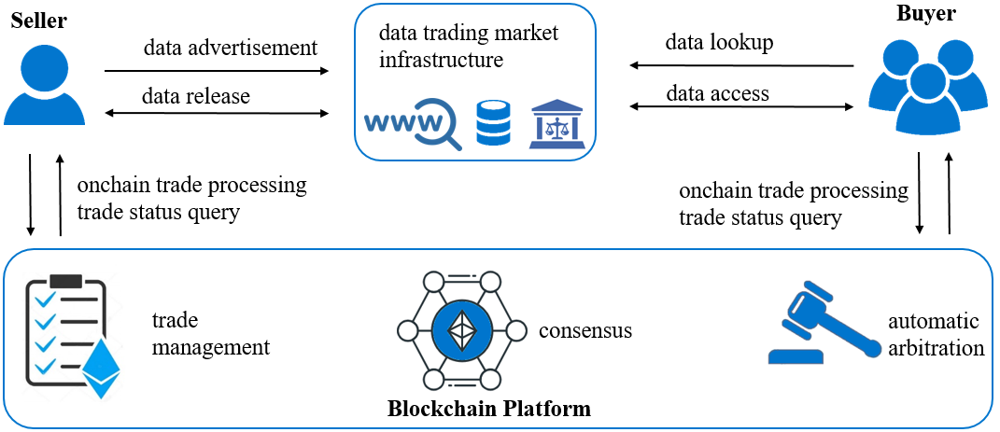

# A two-stage approach for fair data trading based on blockchain

How to enable fairness for e-commerce applications has attracted
years of research. Recent research has proposed employing blockchain
smart contract as an efficient trusted third party (TTP) to enable
fair data trading. However, the state-of-the-art schemes suffer from
two issues, i.e., they either fail to work for situations where data
validity cannot be encoded as an oracle function in the smart contract,
or leak data to attackers for free. To resolve these issues,
this paper proposes a two-stage approach for blockchain-based fair
data trading. The main idea is to employ a lightweight off-chain
TTP and an on-chain smart contract to handle dispute issues. Both
the TTP and smart contract only require a logarithmic complexity
for making arbitration in case of disputes; moreover, they are not
invoked when there is no dispute. The rationale is that the offchain
TTP is only needed in a minimal sense to judge the validity
of the traded data. The proposed approach designs a new cryptographic
protocol that combines sampling, commitment schemes,
and encryption schemes to achieve this logarithmic efficiency. The
proposed approach also features privacy protection.

This repository lists the implementation of the proposed blockchain based data trading scheme.
In the following, we show how to reproduce the experimental results reported in our paper.

## System Model

<figure>
  

    
<figcaption>Figure 1: System model</figcaption>
  

</figure>

We formulated the blockchain based data trading problem as in Figure <a href="#system-model">1</a>.
The proposed scheme has four entities, namely, data owner, data buyer, market
infrastructure, and blockchain. The data owner is an entity that is
going to sell some data once or multiple times. The data buyer is an
entity that wants to buy some useful data. The market infrastructure
is an abstract entity that provides communication mediums and a
trusted third party (TTP) service for the data owner and the data
buyer. The blockchain is an entity that provides trade management
and smart contract services for fair data trading.

We implemented the proposed scheme on the Ethereum Sepolia
test network. The implementation includes the trade management part
(200 LoC) and data trading market infrastructure part (3K LoC) as
follows.

### Trade Management
We implemented this part as a smart contract written in Solidity. It streamlines data trading processes by
utilizing events to coordinate interactions between the data owner and the data buyer. The data owner (DO) pledges the data for sale by
invoking the Commit Data event. The data buyer (DB) initiates the Challenge event to request sample data from the DO, providing an
earnest payment. In response, the DO triggers the Respond event.
After examining the sample data, the DB completes the payment
using the Pay Left event. Subsequently, the DO releases the encryption key through the Release Master Key event. During the arbitration process, both the DB and the data DO engage in the On-chain arbitrate and Off-chain arbitrate events.
### Data Trading Market Infrastructure
We implemented this part as a Go client program. It simulates the most essential aspects of data trading market infrastructure. Specifically, it focused on the comprehensive process of executing interactions with the smartcontract. We employed the go-ethereum package to facilitate the interactions with the blockchain. It is worth noting that advertisement and negotiation in the off-chain market infrastructure could be conducted using various platforms in practice, e.g., Web services, instant communication apps, etc.
## How to Run

1. First, deploy the contract using Remix, and obtain the contract address.
2. Modify the contract address, as well as fill in the addresses and private keys of both buyer and seller into the `config.yaml` file.
3. Modify the path of the data to be traded in the `trading_test.go` file.
4. Generate the code required to invoke the contract by executing `abigen --abi trading.abi --pkg mycontract --type trading --out ./mycontract/trading.go`.
5. All tests can be executed by running `go test -v`.
6. Alternatively, you can specify to run a specific function by running `go test -run TestMyFunction`.

## Directory Explanation
The project files are composed of several directories that are accompanied by a brief explanation for each.
- `utils`：Utility classes.
- `merkle`：Implementation related to Merkle Tree.
- `hmac`：Implementation related to HMAC.
- `mycontract`：Location to store auto-generated Go code by abigen.
- `aes`：Implementation related to AES.
- `encTest/output`：Location of processed data.
- `encTest/keys`：The directory where keys that encrypt raw data are stored. These keys are created by masterK1
- `encTest/enckeys`：The directory where encrypted keys are stored. These encrypted keys are encrypted by key2.
- `encTest/key2s`：The directory where keys that encrypt raw keys are stored. These keys are created by masterK2.
- `encTest/file2Buyer`：The location where simulated files to be sent to the database are stored.
## Usage
The project can be run through the use of command line commands, with a detailed explanation of each step provided below.
### Preparation
DO can preprocess the data, including generating keys and encrypting data with keys by running
`go test -run TestPreparation`.
Make sure the related folder has been created before running.
### Commit Data
In this step, Merkle tree commitment will be performed on the data by DO.
`go test -run TestCommitData`.
### Challenge
Before running the Challenge, DB need to run the PreChallenge simulation to get the encrypted data
`go test -run TestPreChallenge`
and then run `go test -run TestChallenge` to rasie challenge.
### Response
DO can run
`go test -run TestResponse` to response challenge.
The main content is to perform Merkle tree commitment on subkeys.
### Payleft
DB can run
`go test -run TestPayleft` to pay the remaining money.
Before making the final payment, DB can perform the `CheckSample` operation. 
Here we only provide performance tests for `CheckSample`.
### Benchmark
#### time cost
We have conducted benchmark testing for every step in our source code, which provides a quantitative measurement of the time needed for the code to be executed on the specific machine.
Run the corresponding benchmark function to perform benchmark tests e.g. `go test -run none -bench=BenchmarkEncryptFileWithMasterKey -benchmem`.
#### storage cost
To ensure efficient storage usage, it is crucial to monitor the storage cost for every subdirectory in the `encTest` directory.